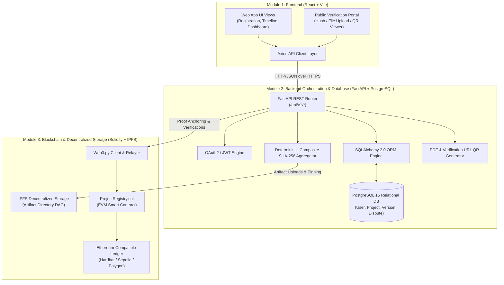
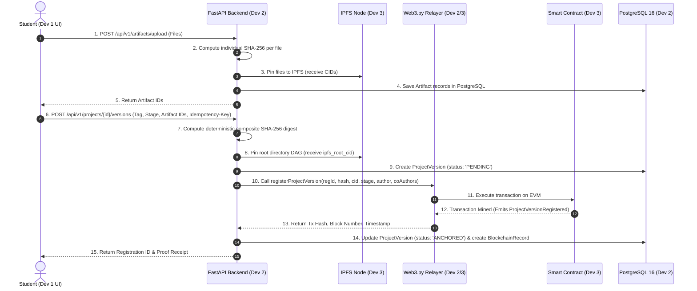
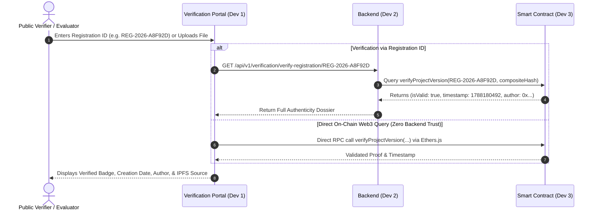

# Monorepo Integration & Cross-Module Contract

> **Project**: Blockchain-Based Student Project Ownership Registry (CYB05)  
> **Target Modules**: 1. Frontend | 2. Backend + PostgreSQL | 3. Blockchain + IPFS  
> **Document Version**: 3.0 (Phase 1 — Final Frozen Architecture)  
> **Audience**: All 3 Developers & System Architects

---

## 1. System Topology & Cross-Module Boundaries

---

## 2. Cross-Module Responsibility Matrix

| Feature / Capability | Frontend (Developer 1) | Backend (Developer 2) | Blockchain & IPFS (Developer 3) |
| :--- | :--- | :--- | :--- |
| **User Authentication & Login** | Login/Register UI, Token Storage, Protected Routes | JWT Issue, Password Hashing, Role Authorization | None (Zero Auth on-chain) |
| **Project Creation & Metadata** | Form inputs, category dropdowns, client validation | Slug generation, PostgreSQL record creation | None |
| **Team Member Invitations** | Team management UI, member invite forms | Membership authorization, email/in-app notification | None |
| **Artifact Intake & File Handling** | File dropzone, progress bars, MIME validation | Streaming file intake, file size enforcement | Raw artifact pinning on IPFS node |
| **File Hashing (SHA-256)** | None (zero heavy hashing on client) | Deterministic composite SHA-256 calculation | Validates `bytes32` digest parameter on-chain |
| **IPFS Storage Management** | Displays IPFS gateway download links | Pins multi-file directory to IPFS, records root CID | IPFS Node cluster configuration & availability |
| **Blockchain Proof Anchoring** | Displays pending status spinner & receipt link | Web3.py transaction signing, relayer gas management | `ProjectRegistry.sol` emits `ProjectVersionRegistered` event |
| **Public Verification Engine** | Public verification search bar & file dropzone | Orchestrates comparison between DB, Hash, & Chain | `verifyProjectVersion()` view function execution |
| **Certificates & QR Codes** | Displays certificate preview & QR code image | Renders PDF certificate & encodes verification URL QR | Immutability reference data source |
| **Dispute Filing & Adjudication**| Dispute intake form & status timeline badge | Stores claims in PostgreSQL, notifies admins | `raiseDispute()` / `resolveDispute()` state update |
| **AI Similarity Detection** | *FUTURE ENHANCEMENT* | *FUTURE ENHANCEMENT* | *None* |

---

## 3. End-to-End Core Data Flow Diagrams

### 3.1 Project Version Anchoring Flow

### 3.2 Independent Trustless Verification Flow

---

## 4. Failure Scenarios & Resilience Matrix

| Scenario | System State | Retry Behavior | User-Visible Result | Database State | Blockchain State |
| :--- | :--- | :--- | :--- | :--- | :--- |
| **A. IPFS fails before DB commit** | File upload interrupted | Client retries file upload | HTTP `502 Bad Gateway` ("Storage node unavailable") | No orphaned DB record created | No transaction sent to blockchain |
| **B. DB succeeds but Blockchain fails** | Version in `FAILED` state | Background worker or user triggers retry | Milestone visible in dashboard with "Anchoring Failed — Click to Retry" | `anchoring_status = 'FAILED'`, `composite_sha256` preserved | Transaction reverted or dropped; no state changed |
| **C. Blockchain succeeds but Backend times out** | On-chain record created; HTTP client received timeout | Client retries request with same `Idempotency-Key` | Client receives existing `ANCHORED` record on retry | Background reconciler detects on-chain receipt and updates status to `'ANCHORED'` | Valid record exists on blockchain |
| **D. Blockchain succeeds but PostgreSQL update fails** | Temporary DB disconnection | Background sync job queries smart contract by `registrationId` | Temporary "Anchoring in progress" status, auto-resolves within 60s | Record transitioned from `ANCHORING` to `ANCHORED` upon next sync cycle | Valid record exists on blockchain |
| **E. User retries same request** | Idempotent request intercepted | Returns existing cached record immediately | HTTP `200 OK` with existing `ProjectVersion` payload | No duplicate rows created | Zero additional gas spent; no duplicate transaction |
| **F. Verification detects hash mismatch** | Content altered / forged | None | Red "TAMPER DETECTED / INVALID" banner with expected vs computed hash | No DB change | Smart contract returns `isValid = false` |

---

## 5. Non-Functional Requirements (NFR) Specifications

### 5.1 Security Requirements
* **Password Hashing**: Passwords stored using **Argon2id** (memory cost: 65536 KiB, time cost: 3 iterations).
* **JWT Expiration & Scope**: Access tokens expire in 60 minutes; Refresh tokens expire in 7 days and support rotation.
* **Smart Contract Safety**: Solidity `0.8.24+` with native checked arithmetic, `ReentrancyGuard`, and `Ownable2Step` for administrative functions.
* **Relayer Key Protection**: The backend relayer private key must be injected via secure environment variable (`RELAYER_PRIVATE_KEY`) and never logged or exposed.

### 5.2 Performance Requirements
* **API Read Latency**: $p95 \le 120\text{ ms}$ for standard relational queries (cached with database indexes).
* **Artifact Upload Throughput**: Multipart streaming directly to local staging without accumulating entire large files in server RAM.
* **Asynchronous Blockchain Execution**: Long-running blockchain confirmations do not block the primary HTTP thread (handled via async task queue/worker).

### 5.3 Reliability & Auditability
* **Blockchain Confirmation Depth**: Minimum 2 block confirmations on public testnets/mainnet before transitioning status to `ANCHORED`.
* **Idempotency**: Retrying a project version registration with identical composite hash will return the existing record without wasting gas on a duplicate transaction.
* **Immutable Audit Trail**: All status modifications to disputes and projects are recorded with timestamps and acting user IDs.

### 5.4 Privacy & GDPR Compliance
* **Personal Data Boundary**: No student legal names, emails, phone numbers, or institutional IDs are written to the public blockchain ledger. Only pseudonymous wallet addresses, content hashes, and registration IDs exist on-chain.
