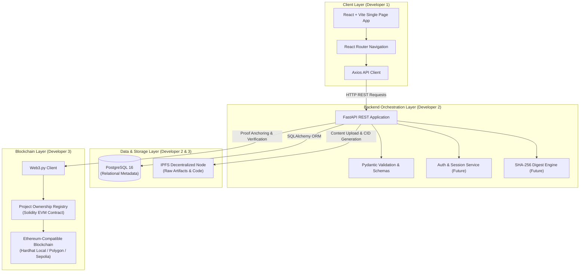
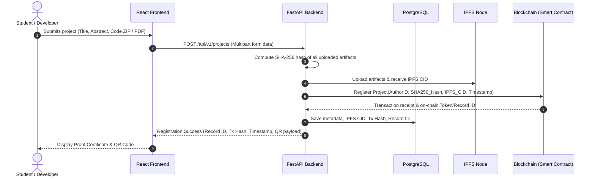

# System Architecture Specification

> **Project**: Blockchain-Based Student Project Ownership Registry  
> **Problem Statement**: SIH 2026 CYB05  
> **Document Version**: 1.0 (Phase 0 Baseline)

---

## 1. High-Level Architecture Overview

The system is designed with a hybrid on-chain / off-chain architecture that maximizes cryptographic immutability, data availability, and cost efficiency.

---

## 2. Component Layer Responsibilities

### 2.1 Frontend (Client Layer)
- **Role**: Provides student registration portals, project submission interfaces, version provenance timelines, QR code verification viewers, and certificate export tools.
- **Boundaries**: Interacts exclusively with the FastAPI backend via structured REST endpoints. Does not talk directly to PostgreSQL or make raw unauthenticated Web3 calls for mutation.

### 2.2 Backend (FastAPI Layer)
- **Role**: Serves as the central orchestrator and business logic gateway.
- **Key Duties**:
  - Request validation and authorization.
  - Streaming file intake, calculating cryptographic SHA-256 hashes.
  - Offloading full artifacts to IPFS and receiving content identifiers (CIDs).
  - Calling smart contracts via Web3.py to anchor ownership records.
  - Generating verification certificates and signing verifiable credentials.

### 2.3 Storage Layer (Hybrid Off-Chain Model)

| Storage Engine | Purpose | Why This Choice? |
| :--- | :--- | :--- |
| **PostgreSQL 16** | Application metadata, user profiles, tags, categories, search indexes, relational audit logs. | Fast relational querying, indexing, and transactional integrity. |
| **IPFS (InterPlanetary File System)** | Raw project code files, documentation PDFs, design schematics, and presentation slides. | Content-addressable, decentralized, tamper-evident off-chain file storage. |
| **Ethereum / EVM Blockchain** | Cryptographic hash digests (SHA-256 / IPFS CID), author wallet addresses, timestamps, version numbers, dispute state. | Immutability, zero censorship, trustless independent verification. |

> [!IMPORTANT]
> **Zero File On-Chain Rule**: Storing large binary files on a blockchain is prohibitively expensive and causes chain bloat. In our architecture, **no files are stored on-chain**. Only fixed 32-byte cryptographic hashes and metadata pointers are anchored on-chain.

---

## 3. End-to-End Project Registration Data Flow (Planned for Phase 2)

---

## 4. Verification Workflow

Anyone (examiner, hackathon evaluator, recruiter, patent agent) can verify a project independently:

1. **Hash Verification**: The verifier uploads a project file or enters the project ID.
2. **On-Chain Query**: The backend/verifier queries the smart contract for the anchored hash and original creation timestamp.
3. **Integrity Match**: If `SHA256(Uploaded_File) == Anchored_OnChain_Hash`, proof of original creation and non-tampering is mathematically guaranteed.
