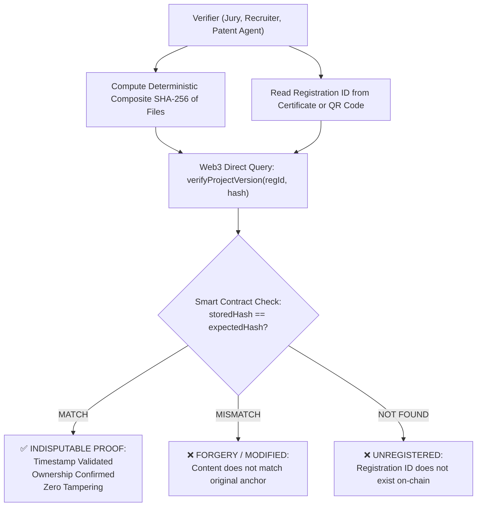

# Smart Contract & Blockchain Architecture Design

> **Project**: Blockchain-Based Student Project Ownership Registry (CYB05)  
> **Target Virtual Machine**: EVM (Ethereum Virtual Machine)  
> **Solidity Version Target**: `^0.8.24`  
> **Target Networks**: Local Hardhat (`ChainID: 31337`), Sepolia Testnet (`ChainID: 11155111`), Polygon Amoy / Mainnet  
> **Document Version**: 3.0 (Phase 1 — Final Frozen Architecture)  
> **Audience**: Developer 3 (Blockchain Lead), Developer 2 (Backend Lead), Developer 1 (Frontend Lead)

---

## 1. System Philosophy: The Trustless Cryptographic Notary

The blockchain layer serves as an **immutable, decentralized, and tamper-resistant notary**. Its primary mandate is to establish mathematically provable **Proof of Existence**, **Proof of Ownership**, and **Proof of Integrity** for academic projects and intellectual property.

### Invariant Rules:
1. **Zero Raw Files On-Chain**: No PDF, ZIP, code file, or large binary is ever stored on the blockchain.
2. **Fixed-Size Cryptographic Anchors**: Only 32-byte hash digests (`bytes32 compositeHash`), content identifiers (`string ipfsCID`), and cryptographic addresses (`address`) are anchored.
3. **Deterministic Verification**: Any third party can independently verify a project's authenticity directly against the smart contract without trusting the backend API.

---

## 2. Deterministic Composite SHA-256 Algorithm Specification

To guarantee that any independent validator (in Python, TypeScript, Solidity, Go, or Rust) produces the exact same 32-byte cryptographic root hash given the same project artifacts and metadata, the calculation process is strictly standardized.

### 2.1 Algorithm Specification

1. **Participating Artifacts**:
   * Every file belonging to the specific project version snapshot is included.
   * Empty versions (0 files) are invalid and rejected.

2. **Artifact Sorting Order**:
   * Artifacts are sorted in ascending lexicographical order based on their canonical UTF-8 file name using standard ASCII / Unicode byte-order comparison (`a < b < c`).
   * Example: `"architecture.pdf" < "diagram.png" < "source_code.zip"`.

3. **Participating Fields per Artifact**:
   * `file_name`: Normalized string (lowercase extensions preserved, no leading/trailing whitespace).
   * `file_size_bytes`: Integer formatted as base-10 ASCII string.
   * `sha256_hash`: Standard 64-character lowercase hexadecimal SHA-256 digest of the raw file contents.

4. **Canonical Line Serialization**:
   Each artifact is serialized into a single line formatted as:
   $$\text{Line}_i = \text{file\_name}_i \parallel \text{":"} \parallel \text{file\_size\_bytes}_i \parallel \text{":"} \parallel \text{sha256\_hash}_i$$

5. **Payload Delimiter & Character Encoding**:
   * Character Encoding: Strict **UTF-8** without Byte Order Mark (BOM).
   * Line Delimiter: Standard Unix newline `\n` (`0x0A`) between artifact lines. No trailing newline after the last artifact.

6. **Composite Hashing Procedure**:
   $$\text{Canonical String} = \text{Line}_1 \parallel \text{"\n"} \parallel \text{Line}_2 \parallel \text{"\n"} \parallel \dots \parallel \text{Line}_n$$
   $$\text{Composite SHA-256 (Hex)} = \text{SHA-256}_{\text{hex}}(\text{Canonical String})$$
   $$\text{Composite Hash (bytes32)} = \text{bytes32}(\text{0x} \parallel \text{Composite SHA-256 (Hex)})$$

---

### 2.2 Concrete Worked Example

#### Input Artifacts:
* **Artifact 1**: File name: `report.pdf`, Size: `1048576` bytes, Content SHA-256: `e3b0c44298fc1c149afbf4c8996fb92427ae41e4649b934ca495991b7852b855`
* **Artifact 2**: File name: `code.zip`, Size: `5242880` bytes, Content SHA-256: `ca978112ca1bbdcafac231b39a23dc4da786081cd1e14eed6eaa5d1123c7a718`
* **Artifact 3**: File name: `design.png`, Size: `2097152` bytes, Content SHA-256: `8b1a9953c4611296a827abf8c47804d7ecd8cbe8b8f8a0fecd955f10fc94aea9`

#### Step 1: Sort by File Name Lexicographically
1. `code.zip`
2. `design.png`
3. `report.pdf`

#### Step 2: Construct Canonical Lines
* Line 1: `code.zip:5242880:ca978112ca1bbdcafac231b39a23dc4da786081cd1e14eed6eaa5d1123c7a718`
* Line 2: `design.png:2097152:8b1a9953c4611296a827abf8c47804d7ecd8cbe8b8f8a0fecd955f10fc94aea9`
* Line 3: `report.pdf:1048576:e3b0c44298fc1c149afbf4c8996fb92427ae41e4649b934ca495991b7852b855`

#### Step 3: Concatenate with `\n` Delimiter
```text
code.zip:5242880:ca978112ca1bbdcafac231b39a23dc4da786081cd1e14eed6eaa5d1123c7a718
design.png:2097152:8b1a9953c4611296a827abf8c47804d7ecd8cbe8b8f8a0fecd955f10fc94aea9
report.pdf:1048576:e3b0c44298fc1c149afbf4c8996fb92427ae41e4649b934ca495991b7852b855
```

#### Step 4: Compute Composite SHA-256 Digest
* **UTF-8 Byte Length**: 252 bytes
* **Composite SHA-256 Digest (Hex)**: `9f86d081884c7d659a2feaa0c55ad015a3bf4f1b2b0b822cd15d6c15b0f00a08`
* **Solidity `bytes32` Representation**: `0x9f86d081884c7d659a2feaa0c55ad015a3bf4f1b2b0b822cd15d6c15b0f00a08`

---

## 3. Relayer vs. Project Owner & Trust Boundary

In decentralized academic applications, students cannot be expected to manage cryptocurrency balances (gas fees) or private seed phrases. Therefore, the system utilizes a **Gas Relayer Model**.

```
┌─────────────────────────┐
│  Authenticated Student  │ (Verified institutional login + optional wallet)
└────────────┬────────────┘
             │ HTTP / JWT (OAuth2 Bearer)
             ▼
┌─────────────────────────┐
│     FastAPI Backend     │ (Validates session, builds registration payload)
└────────────┬────────────┘
             │ Web3.py Signed Transaction
             ▼
┌─────────────────────────┐
│   Gas Relayer Wallet    │ (Holds gas balance; acts as transaction sender: msg.sender)
└────────────┬────────────┘
             │ eth_sendRawTransaction
             ▼
┌─────────────────────────┐
│  ProjectRegistry.sol    │ (Stores authorAddress & coAuthors explicitly in contract storage)
└─────────────────────────┘
```

### Trust Boundary & Identity Separation:
1. **`msg.sender` (Transaction Sender)**:
   * The Ethereum address of the platform Gas Relayer wallet.
   * `msg.sender` pays the network gas fee and executes the contract mutation.
2. **`authorAddress` (Project Owner)**:
   * The declared Ethereum wallet address of the authenticated student (or `0x0000000000000000000000000000000000000000` / fallback institutional public key if the student does not have a personal Web3 wallet).
   * Passed explicitly as a function parameter `address authorAddress` and permanently stored in the `VersionProof` on-chain record.
3. **`coAuthors` (Contributors)**:
   * An array of wallet addresses (`address[] calldata coAuthors`) representing team members.
4. **Validation & Protection against Backend Impersonation**:
   * The smart contract enforces that only the authorized Relayer (or contract owner via `onlyRelayer`) can invoke `registerProjectVersion`.
   * For Phase 2 production, student wallets can optionally provide an EIP-712 typed signature to cryptographically prove ownership off-chain before the relayer submits the transaction.

---

## 4. On-Chain vs. Off-Chain Data Storage Matrix

| Data Element | Storage Location | Source of Truth | Technical Rationale |
| :--- | :--- | :---: | :--- |
| **Raw Project Files (Code, PDF, Models)** | **IPFS** (Decentralized Storage) | **Authoritative (Content)** | Prohibitive gas costs on-chain; IPFS provides decentralized content addressability. |
| **Individual File SHA-256 Hashes** | **PostgreSQL** | Application Index | Fast relational filtering and file-by-file UI display. |
| **Composite Version SHA-256 Digest** | **Blockchain + PostgreSQL** | **Authoritative Proof (Chain)** | The 32-byte cryptographic root anchored immutably into Ethereum state. |
| **Root IPFS Directory CID** | **Blockchain + PostgreSQL** | **Authoritative Proof (Chain)** | Trustless pointer ensuring the exact artifact package cannot be swapped. |
| **Registration ID (`REG-YYYY-XXXXX`)** | **Blockchain + PostgreSQL** | **Authoritative Proof (Chain)** | Public lookup key linking physical certificates/QR codes to smart contract records. |
| **Block Timestamp & Block Height** | **Blockchain (Header)** | **Authoritative Proof (Chain)** | Indisputable, tamper-proof proof of chronological precedence (prior art). |
| **Author & Contributor Wallets** | **Blockchain + PostgreSQL** | **Authoritative Proof (Chain)** | Cryptographic record of ownership and academic attribution. |
| **User Profiles, Passwords, Emails** | **PostgreSQL** | **Authoritative (PostgreSQL)**| GDPR privacy compliance, relational indexing, auth credentials (NEVER on-chain). |
| **Project Descriptions & Titles** | **PostgreSQL** | **Authoritative (PostgreSQL)**| Searchable academic catalog, tags, category filtering. |
| **Dispute Status & Claims** | **PostgreSQL + Blockchain State**| Hybrid | Detailed claim narratives in PostgreSQL; formal flag recorded in smart contract. |

---

## 5. Smart Contract Interface Specification (`IProjectRegistry`)

The core production smart contract is designated as **`ProjectRegistry.sol`**.

```solidity
// SPDX-License-Identifier: MIT
pragma solidity ^0.8.24;

/**
 * @title IProjectRegistry
 * @dev Interface for the Blockchain-Based Student Project Ownership Registry.
 */
interface IProjectRegistry {
    // =========================================================================
    // ENUMS & DATA STRUCTURES
    // =========================================================================

    enum LifecycleStage { IDEA, DESIGN, PROTOTYPE, FINAL }
    enum DisputeStatus { NONE, OPEN, UNDER_REVIEW, RESOLVED, REJECTED }

    struct VersionProof {
        uint256 recordId;              // Sequential global on-chain index
        string registrationId;         // e.g. "REG-2026-A8F92D"
        bytes32 compositeHash;         // Merged SHA-256 digest of all version files
        string ipfsRootCID;            // IPFS directory CID containing artifacts
        uint16 versionIndex;           // 1, 2, 3...
        LifecycleStage lifecycleStage; // IDEA, DESIGN, PROTOTYPE, FINAL
        address author;                // Student project owner wallet address
        address[] coAuthors;           // Team member wallet addresses
        uint256 anchoredTimestamp;     // block.timestamp at time of inclusion
        uint256 blockNumber;           // block.number at time of inclusion
        DisputeStatus disputeState;    // Active dispute standing
        bool exists;                   // Existence check flag
    }

    // =========================================================================
    // EVENTS
    // =========================================================================

    event ProjectVersionRegistered(
        uint256 indexed recordId,
        string indexed registrationId,
        bytes32 indexed compositeHash,
        string ipfsRootCID,
        uint16 versionIndex,
        LifecycleStage stage,
        address author,
        address relayer,
        uint256 timestamp
    );

    event DisputeLogged(
        string indexed registrationId,
        address indexed claimant,
        string evidenceCID,
        uint256 timestamp
    );

    event DisputeResolved(
        string indexed registrationId,
        DisputeStatus newStatus,
        address adjudicatedBy,
        uint256 timestamp
    );

    // =========================================================================
    // CORE REGISTRY FUNCTIONS
    // =========================================================================

    /**
     * @notice Anchors an immutable project version snapshot on-chain.
     * @param registrationId Unique certificate ID (e.g., "REG-2026-A8F92D")
     * @param compositeHash 32-byte deterministic SHA-256 digest
     * @param ipfsRootCID Root IPFS directory CID
     * @param versionIndex Sequential version number (1, 2, 3...)
     * @param stage Milestone lifecycle stage
     * @param author Project owner student wallet address
     * @param coAuthors List of team member wallet addresses
     * @return recordId The assigned global record ID
     */
    function registerProjectVersion(
        string calldata registrationId,
        bytes32 compositeHash,
        string calldata ipfsRootCID,
        uint16 versionIndex,
        LifecycleStage stage,
        address author,
        address[] calldata coAuthors
    ) external returns (uint256 recordId);

    /**
     * @notice Trustless public verification endpoint.
     * @param registrationId The certificate registration identifier
     * @param expectedHash The SHA-256 hash to verify against the on-chain anchor
     * @return isValid True if hash matches and record exists
     * @return anchoredTimestamp The block timestamp of registration
     * @return ipfsRootCID The associated IPFS storage CID
     * @return author The project owner wallet address
     * @return disputeState The active dispute standing
     */
    function verifyProjectVersion(
        string calldata registrationId,
        bytes32 expectedHash
    ) external view returns (
        bool isValid,
        uint256 anchoredTimestamp,
        string memory ipfsRootCID,
        address author,
        DisputeStatus disputeState
    );

    /**
     * @notice Retrieves full on-chain version proof struct.
     * @param registrationId The certificate registration identifier
     */
    function getProjectVersion(
        string calldata registrationId
    ) external view returns (VersionProof memory);

    /**
     * @notice Logs an on-chain dispute notice against an anchored version.
     * @param registrationId The disputed certificate identifier
     * @param evidenceCID IPFS CID pointing to claimant's evidence dossier
     */
    function raiseDispute(
        string calldata registrationId,
        string calldata evidenceCID
    ) external;

    /**
     * @notice Adjudicates a dispute (Restricted to Authorized Admin/Contract Owner).
     * @param registrationId The disputed certificate identifier
     * @param status The final resolution status
     */
    function resolveDispute(
        string calldata registrationId,
        DisputeStatus status
    ) external;
}
```

---

## 6. Trustless Verification Mechanics

Anyone with the registration ID and original files can verify provenance without accessing the backend database:


