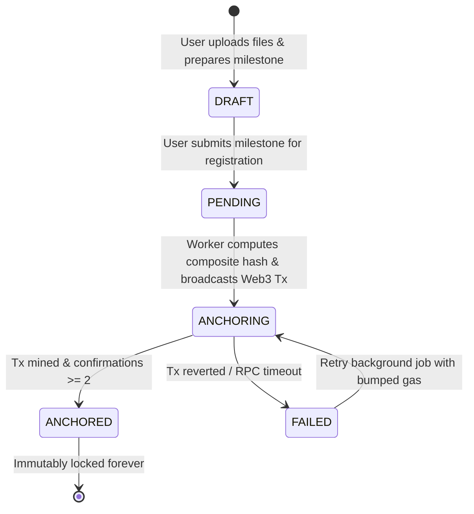
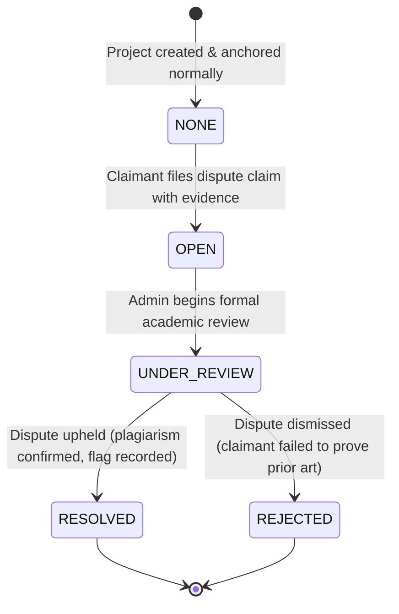

# Database Domain Model & Schema Design Specification

> **Project**: Blockchain-Based Student Project Ownership Registry (CYB05)  
> **Target Database**: PostgreSQL 16  
> **ORM Layer**: SQLAlchemy 2.0  
> **Migration Framework**: Alembic 1.14+  
> **Document Version**: 3.0 (Phase 1 — Final Frozen Architecture)  
> **Audience**: Developer 2 (Backend/Database Lead), Developer 1 (Frontend), Developer 3 (Blockchain)

---

## 1. Architectural Principles & Overview

The database acts as the **stateful application and metadata layer** for the platform. While the blockchain provides immutable cryptographic anchoring and trustless timestamping, PostgreSQL manages user profiles, rich descriptions, institutional affiliations, relational memberships, search indexes, and rapid query lookups.

### Core Database Rules:
1. **Never store raw binary project files in PostgreSQL**: Files are stored in IPFS; PostgreSQL stores only metadata, content hashes (`sha256_hash`), and content addresses (`ipfs_cid`).
2. **Deterministic Foreign Keys & Cascades**: Deleting an unanchored draft project cascades to its members and artifacts; however, finalized blockchain records are immutable and cannot be deleted.
3. **UTC Timestamps Everywhere**: All timestamp columns are `TIMESTAMP WITH TIME ZONE` (`timestamptz`) defaulting to `CURRENT_TIMESTAMP AT TIME ZONE 'UTC'`.
4. **Separation of Registration and Dispute Lifecycles**: A project version's registration status (`anchoring_status`) is strictly independent of its dispute status (`dispute_status`).

---

## 2. Authoritative Data Model: Source of Truth Mapping

| Information Element | Authoritative Source of Truth | Application Cache / Metadata Role |
| :--- | :--- | :--- |
| **Project Metadata (Title, Abstract, Category)** | **PostgreSQL** | Primary source for catalog, search, and UI display |
| **Artifact Raw Files** | **IPFS** | Decentralized, immutable content storage |
| **Artifact Individual SHA-256** | **PostgreSQL** | Pre-computed index for rapid file comparison |
| **Composite Version SHA-256** | **Blockchain State (`bytes32`)** | Authoritative cryptographic root proof of milestone |
| **Root IPFS Directory CID** | **Blockchain State (`string`)** | Authoritative pointer to anchored artifact bundle |
| **Registration ID (`REG-YYYY-XXXXX`)** | **Blockchain + PostgreSQL** | Unique proof token linking physical & on-chain data |
| **Blockchain Transaction Hash** | **Blockchain Receipt (`0x...`)** | Cryptographic inclusion proof on public ledger |
| **Block Timestamp & Block Height** | **Blockchain Header** | Indisputable proof of chronological existence |
| **Project Owner & Team Wallets** | **Blockchain + PostgreSQL** | Cryptographic record of ownership and authorship |
| **Version Registration Status** | **PostgreSQL + Smart Contract** | Tracks asynchronous anchoring state machine |
| **Dispute Status** | **PostgreSQL + Smart Contract** | Manages adjudication lifecycle independently |

---

## 3. Entity-Relationship Domain Model

```mermaid
erDiagram
    USER ||--o{ PROJECT_MEMBER : "participates_in"
    USER ||--o{ NOTIFICATION : "receives"
    USER ||--o{ DISPUTE : "raises_as_claimant"
    
    PROJECT ||--|{ PROJECT_MEMBER : "has_members"
    PROJECT ||--|{ PROJECT_VERSION : "contains_versions"
    PROJECT ||--o{ DISPUTE : "subject_to"
    
    PROJECT_VERSION ||--|{ ARTIFACT : "comprises_files"
    PROJECT_VERSION ||--o| BLOCKCHAIN_RECORD : "anchored_as"

    USER {
        uuid id PK "Internal Database Primary Key"
        string public_id UK "USR-xxxx public reference"
        string email UK "Normalized lowercase email"
        string hashed_password "Argon2/bcrypt hash"
        string full_name "Full legal name"
        string institution_id "College / University ID"
        string department "Academic Department"
        string role "STUDENT | FACULTY | ADMIN | VERIFIER"
        string wallet_address "0x... EVM address (optional)"
        boolean is_active "Account active flag"
        boolean is_verified "Institutional email verification"
        timestamptz created_at "Creation timestamp UTC"
        timestamptz updated_at "Last modification timestamp UTC"
    }

    PROJECT {
        uuid id PK "Internal Database Primary Key"
        string public_id UK "PRJ-xxxx public identifier"
        string slug UK "URL-friendly slug"
        string title "Project title"
        text abstract "Project abstract / overview"
        string category "AI | CYBERSECURITY | IOT | WEB3 | etc"
        string department "Academic Department"
        string academic_year "e.g. 2025-2026"
        string current_lifecycle_stage "IDEA | DESIGN | PROTOTYPE | FINAL"
        string visibility "PUBLIC | INSTITUTIONAL | PRIVATE"
        string status "ACTIVE | ARCHIVED | UNDER_DISPUTE"
        timestamptz created_at "Creation timestamp UTC"
        timestamptz updated_at "Last modification timestamp UTC"
    }

    PROJECT_MEMBER {
        uuid id PK "Internal Database Primary Key"
        uuid project_id FK "References PROJECT.id"
        uuid user_id FK "References USER.id"
        string role_in_project "LEAD | CONTRIBUTOR | FACULTY_MENTOR"
        numeric contribution_percentage "Declared % (0-100)"
        boolean is_owner "Primary ownership authority"
        timestamptz invited_at "Invitation timestamp"
        timestamptz joined_at "Acceptance timestamp"
    }

    PROJECT_VERSION {
        uuid id PK "Internal Database Primary Key"
        string public_id UK "VER-xxxx public identifier"
        uuid project_id FK "References PROJECT.id"
        string registration_id UK "REG-YYYY-XXXXX certificate ID"
        string idempotency_key UK "Client deduplication token"
        int version_index "1, 2, 3... sequential"
        string version_tag "v1.0, v1.1, v2.0, etc"
        string lifecycle_stage "IDEA | DESIGN | PROTOTYPE | FINAL"
        string title "Version milestone title"
        text description "Changelog and milestone notes"
        string composite_sha256 "Merged SHA-256 of all version artifacts"
        string ipfs_root_cid "Root IPFS Directory/DAG CID"
        string anchoring_status "DRAFT | PENDING | ANCHORING | ANCHORED | FAILED"
        string dispute_status "NONE | OPEN | UNDER_REVIEW | RESOLVED | REJECTED"
        timestamptz created_at "Creation timestamp UTC"
    }

    ARTIFACT {
        uuid id PK "Internal Database Primary Key"
        string public_id UK "ART-xxxx public identifier"
        uuid version_id FK "References PROJECT_VERSION.id"
        string file_name "Original upload file name"
        string file_type "MIME Type (e.g. application/pdf)"
        bigint file_size_bytes "Size in bytes"
        string sha256_hash "Individual file SHA-256 digest (hex)"
        string ipfs_cid "Individual IPFS file CID (v1)"
        string artifact_category "SOURCE_CODE | DOCUMENTATION | DESIGN_SPEC | PRESENTATION | OTHER"
        timestamptz uploaded_at "Upload timestamp UTC"
    }

    BLOCKCHAIN_RECORD {
        uuid id PK "Internal Database Primary Key"
        string public_id UK "BLK-xxxx public identifier"
        uuid version_id FK,UK "1-to-1 with PROJECT_VERSION.id"
        string transaction_hash "0x... Ethereum Tx hash"
        bigint block_number "Mined block height"
        string block_hash "Mined block hash"
        uint256 onchain_record_id "On-chain counter index in registry"
        string smart_contract_address "0x... Registry contract address"
        string anchored_hash "bytes32 composite hash recorded on-chain"
        string ipfs_cid_anchored "IPFS CID anchored in smart contract"
        string submitter_wallet "0x... Relayer or Author address"
        string author_wallet "0x... Declared student author address"
        string network_name "hardhat | sepolia | polygon | mainnet"
        bigint chain_id "EIP-155 Chain ID"
        timestamptz anchored_timestamp "On-chain block timestamp UTC"
        timestamptz confirmed_at "Backend confirmation timestamp UTC"
    }

    DISPUTE {
        uuid id PK "Internal Database Primary Key"
        string public_id UK "DSP-xxxx public identifier"
        uuid project_id FK "References PROJECT.id"
        uuid claimant_user_id FK "References USER.id"
        string dispute_type "PLAGIARISM | UNAUTHORIZED_USE | CITATION_FAILURE | OTHER"
        text claim_description "Detailed claim explanation"
        string evidence_url "Optional external/IPFS evidence link"
        string status "OPEN | UNDER_REVIEW | RESOLVED | REJECTED"
        text resolution_notes "Admin adjudication rationale"
        uuid resolved_by_admin_id "References USER.id (Admin)"
        timestamptz created_at "Filing timestamp UTC"
        timestamptz resolved_at "Resolution timestamp UTC"
    }

    NOTIFICATION {
        uuid id PK "Internal Database Primary Key"
        string public_id UK "NTF-xxxx public identifier"
        uuid user_id FK "References USER.id"
        string title "Notification header"
        text message "Notification body text"
        string notification_type "BLOCKCHAIN_CONFIRMATION | TEAM_INVITE | DISPUTE_ALERT | SYSTEM"
        string link_url "Target route URL"
        boolean is_read "Read status"
        timestamptz created_at "Created timestamp UTC"
    }
```

---

## 4. Version Registration State Machine

The anchoring lifecycle of a project version follows a strict state transition model. Arbitrary state jumps are strictly rejected by the backend.

### State Machine Transition Rules:
1. **`DRAFT`**: Files are uploaded and associated with the milestone. Edits and file removals are permitted.
2. **`PENDING`**: The user locks the submission. Composite hash is generated and IPFS DAG root is pinned. Milestone is immutable to the user.
3. **`ANCHORING`**: Web3.py relayer broadcasts `registerProjectVersion` to the blockchain and obtains a transaction hash (`0x...`).
4. **`ANCHORED`**: Blockchain receipt confirms inclusion with $\ge 2$ block confirmations. Certificate and QR code become active.
5. **`FAILED`**: EVM execution reverted or network dropped. The backend worker or user can trigger a retry (`FAILED -> ANCHORING`) without creating a duplicate record.

---

## 5. Dispute Lifecycle State Machine

The dispute lifecycle is strictly separated from the registration status:

*Note on Dispute Policy*: The duration of the review window is an **`OPEN PRODUCT/POLICY DECISION`** and is not constrained by fixed database timers.

---

## 6. Idempotency & Deduplication Strategy

To prevent accidental duplicate registrations when network timeouts occur between Frontend and Backend:

1. **Client-Supplied Idempotency Key**:
   * The client generates a unique UUID `Idempotency-Key` (or sends the `version_tag` and `project_id`).
2. **Database Level Constraints**:
   * `UNIQUE (project_id, version_index)` guarantees sequential uniqueness.
   * `UNIQUE (registration_id)` guarantees single certificate allocation.
   * `UNIQUE (idempotency_key)` guarantees exactly-once request processing.
3. **Retry Handling**:
   * If a client retries `POST /projects/{id}/versions` with an existing `idempotency_key`, the backend intercepts the call and returns the existing `ProjectVersion` record with HTTP `200 OK` rather than initiating a duplicate Web3 transaction.

---

## 7. Identifier Strategy Specification

| Identifier Type | Format Pattern | Scope & Accessibility | Example | Purpose |
| :--- | :--- | :--- | :--- | :--- |
| **Internal Database ID** | RFC 4122 `UUIDv4` | Internal Backend / DB Only | `a3b8c2d1-9f4e-4b2a-8d1e-3f6a7b8c9d0e` | High-performance joins, strict database normalization. **NEVER exposed in frontend URL params.** |
| **User Public ID** | `USR-YYYYMM-XXXXX` | Frontend / API | `USR-202608-8F29A` | Safe public reference for user profiles without exposing database internal structure. |
| **Project Public ID** | `PRJ-YYYYMM-XXXXX` | Frontend / API | `PRJ-202608-99B12` | Public API routing & direct sharing. |
| **Project Slug** | Kebab-case string | SEO / Web URLs | `decentralized-cloud-registry` | Human-readable vanity URL path. |
| **Version Public ID** | `VER-YYYYMM-XXXXX` | Frontend / API | `VER-202608-41C88` | Identifies specific version milestone. |
| **Registration ID** | `REG-YYYY-XXXXX` | Certificate / QR / Public Verification | `REG-2026-A8F92D` | **The universal proof identifier.** Printed on PDF certificates, embedded in QR codes, and used in verification lookup portals. |
| **Artifact Public ID** | `ART-YYYYMM-XXXXX` | Frontend / API | `ART-202608-11E54` | Secure download route parameter. |
| **Blockchain Public ID**| `BLK-YYYYMM-XXXXX` | Frontend / API | `BLK-202608-77A23` | Public reference to transaction receipt. |
