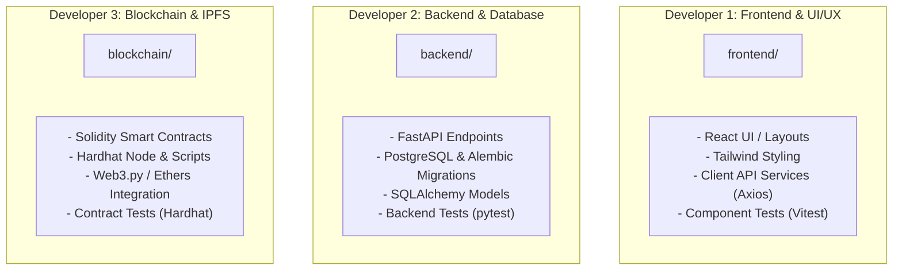
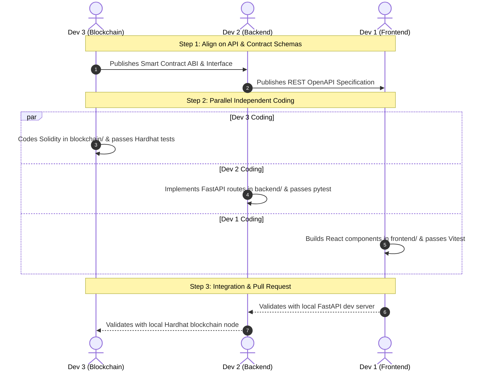

# 3-Developer Collaborative Development Workflow

> **Project**: Blockchain-Based Student Project Ownership Registry (CYB05)  
> **Team Structure**: 3 Specialized Core Developers  
> **Repository Model**: Monorepo with Strict Domain Separation

---

## 1. Developer Roles & Ownership Matrix

| Developer | Scope / Primary Directory | Non-Negotiable Boundaries |
| :--- | :--- | :--- |
| **Developer 1** | `frontend/` | Do not modify database models or smart contracts. Rely strictly on `docs/api/API_CONTRACT.md`. |
| **Developer 2** | `backend/` | Do not alter frontend UI components or blockchain contract interfaces without PR coordination. |
| **Developer 3** | `blockchain/` | Do not alter FastAPI business routing or frontend styling. Provide clean ABIs and testnet addresses to Developer 2. |

---

## 2. Interface Contracts First Principle

> [!CAUTION]
> **No Rogue APIs Rule**: No developer may invent, rename, or modify API endpoints, request schemas, or smart contract function signatures without first documenting and approving them in:
> - REST APIs: [`docs/api/API_CONTRACT.md`](../api/API_CONTRACT.md)
> - Database Entities: [`docs/database/DATABASE_DESIGN.md`](../database/DATABASE_DESIGN.md)
> - Smart Contracts: [`docs/blockchain/BLOCKCHAIN_DESIGN.md`](../blockchain/BLOCKCHAIN_DESIGN.md)

---

## 3. Simultaneous Development Process

---

## 4. Git & Branching Rules

1. **Branch Naming**:
   - `feature/frontend-<name>`
   - `feature/backend-<name>`
   - `feature/blockchain-<name>`
   - `feature/database-<name>`
   - `feature/ipfs-<name>`
   - `feature/verification-<name>`
2. **Pull Request Protocol**:
   - Every PR must have passing unit tests for the modified module.
   - At least 1 other developer must approve the PR.
   - No direct pushes to `main` or `develop`.

---

## 5. Local Development Environments

Each developer can run their own sub-stack locally without blocking others:

- **Developer 1 (Frontend)**: Runs `npm run dev` in `frontend/` using mock endpoints or the local backend container.
- **Developer 2 (Backend)**: Runs `uvicorn app.main:app --reload` in `backend/` with PostgreSQL via `docker compose up -d postgres`.
- **Developer 3 (Blockchain)**: Runs `npx hardhat node` in `blockchain/` and executes `npx hardhat test`.
